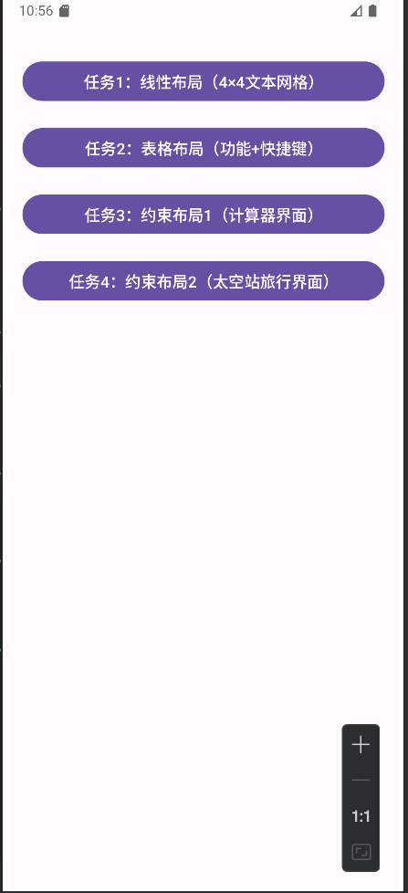
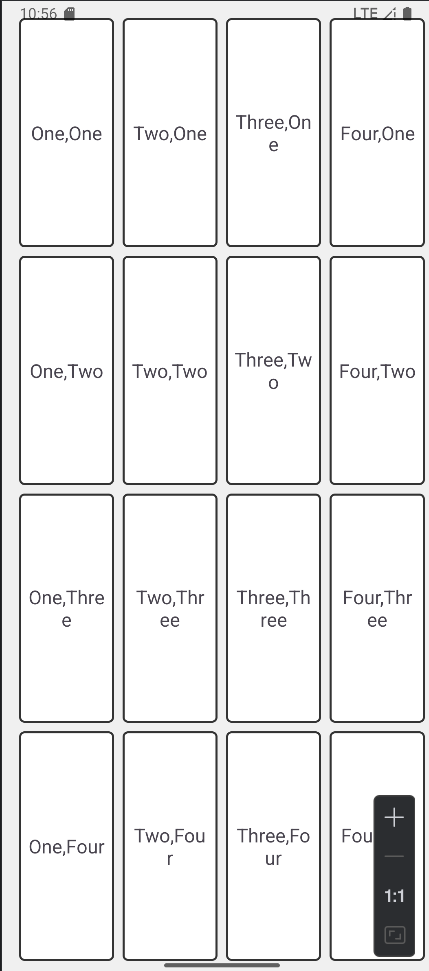
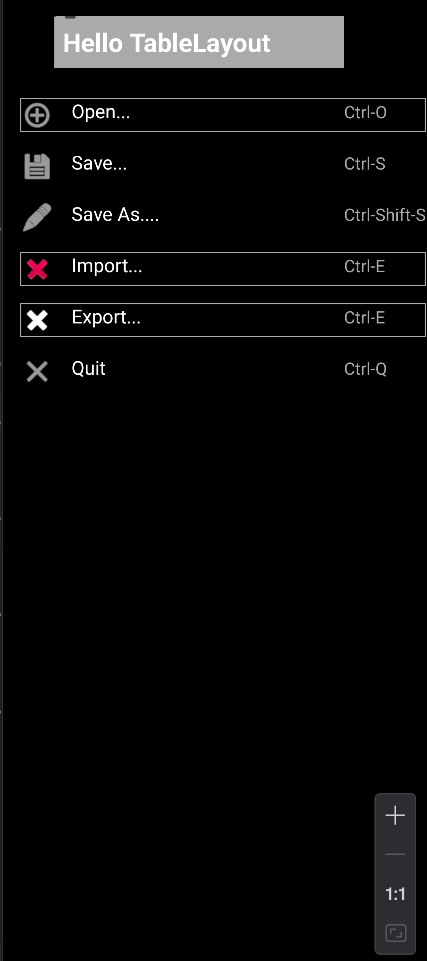
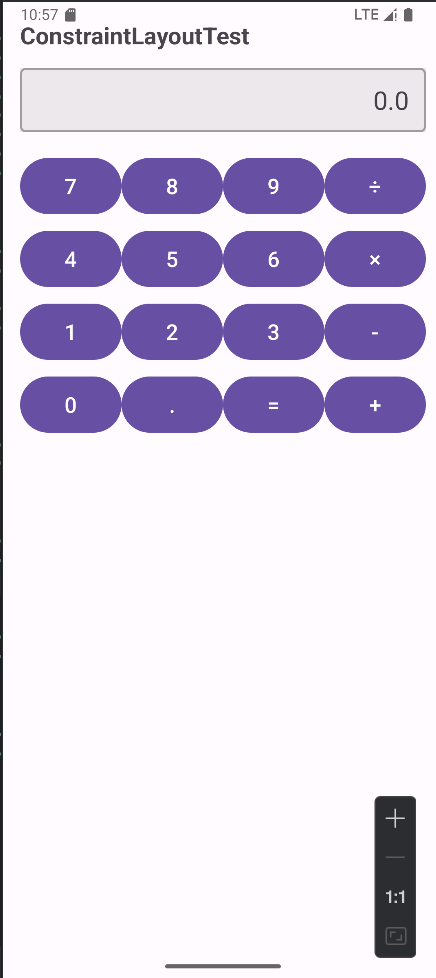
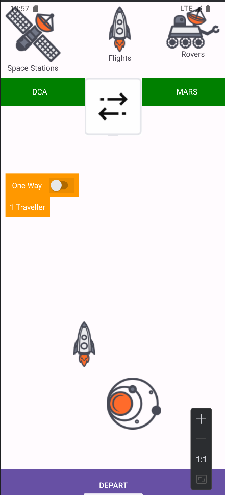

# 实验2_Android界面布局实验报告
## 一、实验目的
1. 学习《实验2_Android界面布局.pdf》中ConstraintLayout、LinearLayout、TableLayout三种核心布局的理论与使用方法，掌握布局文件编写规范。
2. 实现PDF指定的四类界面：LinearLayout 4×4文本网格、TableLayout菜单列表、ConstraintLayout计算器、ConstraintLayout太空主题界面。
3. 掌握布局组件（TextView、ImageView、Switch、Button）的边框、背景色、间距、约束关系配置，满足PDF界面视觉要求。

## 二、实验环境
| 工具/环境        | 版本/配置                  |
|------------------|---------------------------|
| Android Studio   | Hedgehog (2023.1.1)        |
| Android SDK      | API 33 (Android 13)        |
| 模拟器/真机      | Pixel 5 API 33 模拟器      |
| 资源文件         | 实验要求的群文件下载资源（`space_station_icon`、`rocket_icon`、`double_arrows`、`galaxy`等） |

## 三、实验内容与步骤

### 模块1：LinearLayout实现4×4文本网格（“Android布局实验——线性布局”）
1. **创建文本边框样式**  
   在`res/drawable`目录下新建`text_border.xml`，定义文本框的黑色边框：
   ```xml
   <?xml version="1.0" encoding="utf-8"?>
   <shape xmlns:android="http://schemas.android.com/apk/res/android"
       android:shape="rectangle">
       <stroke android:width="1dp" android:color="@android:color/black"/>
       <solid android:color="@android:color/white"/>
       <corners android:radius="4dp"/>
   </shape>
   ```

2. **编写布局文件res/layout/activity_linear_layout.xml**
   根布局为垂直LinearLayout，嵌套 4 个水平LinearLayout实现 4 行，每行 4 个带边框的TextView：
   ```xml
   <?xml version="1.0" encoding="utf-8"?>
    <LinearLayout xmlns:android="http://schemas.android.com/apk/res/android"
    android:layout_width="match_parent"
    android:layout_height="match_parent"
    android:orientation="vertical"
    android:padding="16dp">
    
        <!-- 第1行 -->
        <LinearLayout
            android:layout_width="match_parent"
            android:layout_height="0dp"
            android:layout_weight="1"
            android:orientation="horizontal"
            android:gravity="center"
            android:layout_marginBottom="8dp">
            <TextView
                android:layout_width="0dp"
                android:layout_height="match_parent"
                android:layout_weight="1"
                android:gravity="center"
                android:text="One,One"
                android:textSize="18sp"
                android:background="@drawable/text_border"
                android:layout_marginEnd="8dp"
                android:padding="8dp"/>
            <TextView
                android:layout_width="0dp"
                android:layout_height="match_parent"
                android:layout_weight="1"
                android:gravity="center"
                android:text="Two,One"
                android:textSize="18sp"
                android:background="@drawable/text_border"
                android:layout_marginEnd="8dp"
                android:padding="8dp"/>
            <TextView
                android:layout_width="0dp"
                android:layout_height="match_parent"
                android:layout_weight="1"
                android:gravity="center"
                android:text="Three,One"
                android:textSize="18sp"
                android:background="@drawable/text_border"
                android:layout_marginEnd="8dp"
                android:padding="8dp"/>
            <TextView
                android:layout_width="0dp"
                android:layout_height="match_parent"
                android:layout_weight="1"
                android:gravity="center"
                android:text="Four,One"
                android:textSize="18sp"
                android:background="@drawable/text_border"
                android:padding="8dp"/>
        </LinearLayout>
    
        <!-- 第2行（One,Two ~ Four,Two）、第3行（One,Three ~ Four,Three）、第4行（One,Four ~ Four,Four）结构同上 -->
    </LinearLayout>
   ```

### 模块2：TableLayout 实现菜单列表（“Android 布局实验 —— 表格布局”）
1. **创建分割线样式**
   ```xml
   <?xml version="1.0" encoding="utf-8"?>
    <layer-list xmlns:android="http://schemas.android.com/apk/res/android">
        <item>
            <shape android:shape="rectangle">
                <stroke
                    android:width="1dp"
                    android:color="@android:color/darker_gray" />
                <solid android:color="@android:color/transparent" />
            </shape>
        </item>
        <item android:top="1dp">
            <shape android:shape="rectangle">
                <solid android:color="@android:color/transparent" />
            </shape>
        </item>
    </layer-list>
   ```

   ```xml
   <?xml version="1.0" encoding="utf-8"?>
   <layer-list xmlns:android="http://schemas.android.com/apk/res/android">
       <item>
           <shape android:shape="rectangle">
               <stroke
                   android:width="1dp"
                   android:color="@android:color/darker_gray" />
               <solid android:color="@android:color/transparent" />
           </shape>
       </item>
       <item android:bottom="1dp">
           <shape android:shape="rectangle">
               <solid android:color="@android:color/transparent" />
           </shape>
       </item>
   </layer-list>
   ```
2. **编写布局文件res/layout/activity_table_layout.xml**
   ```xml
   <?xml version="1.0" encoding="utf-8"?>
   <TableLayout xmlns:android="http://schemas.android.com/apk/res/android"
       xmlns:app="http://schemas.android.com/apk/res-auto"
       xmlns:tools="http://schemas.android.com/tools"
       android:layout_width="match_parent"
       android:layout_height="match_parent"
       android:padding="16dp"
       android:stretchColumns="1"
       android:background="@android:color/black">
   
       <TableRow
           android:layout_width="match_parent"
           android:layout_height="wrap_content"
           android:layout_marginBottom="20dp">
   
           <TextView
               android:layout_column="1"
               android:text="Hello TableLayout"
               android:textSize="24sp"
               android:textStyle="bold"
               android:background="@android:color/darker_gray"
               android:textColor="@android:color/white"
               android:padding="8dp" />
       </TableRow>
   
       <!-- 第1行：Open... + Ctrl-O -->
       <TableRow
           android:layout_width="match_parent"
           android:layout_height="wrap_content"
           android:layout_marginVertical="8dp"
           android:background="@drawable/border_top">
   
           <ImageView
               android:layout_width="wrap_content"
               android:layout_height="wrap_content"
               android:src="@android:drawable/ic_menu_add"
               android:contentDescription="Open"
               app:tint="@android:color/white" />
           <TextView
               android:layout_width="wrap_content"
               android:layout_height="wrap_content"
               android:text="Open..."
               android:textSize="18sp"
               android:textColor="@android:color/white" />
   
           <TextView
               android:layout_width="wrap_content"
               android:layout_height="wrap_content"
               android:text="Ctrl-O"
               android:textSize="16sp"
               android:textColor="@android:color/darker_gray" />
       </TableRow>
    
        <!-- 第2行：Save... + Ctrl-S -->
        <TableRow
            android:layout_width="match_parent"
            android:layout_height="wrap_content"
            android:layout_marginVertical="8dp">
    
            <ImageView
                android:layout_width="wrap_content"
                android:layout_height="wrap_content"
                android:src="@android:drawable/ic_menu_save"
                android:contentDescription="Save"
                app:tint="@android:color/white" />
    
            <TextView
                android:layout_width="wrap_content"
                android:layout_height="wrap_content"
                android:text="Save..."
                android:textSize="18sp"
                android:layout_marginStart="16dp"
                android:textColor="@android:color/white" />
    
            <TextView
                android:layout_width="wrap_content"
                android:layout_height="wrap_content"
                android:text="Ctrl-S"
                android:textSize="16sp"
                android:textColor="@android:color/darker_gray" />
        </TableRow>
    
        <!-- 第3行：Save As.... + Ctrl-Shift-S -->
        <TableRow
            android:layout_width="match_parent"
            android:layout_height="wrap_content"
            android:layout_marginVertical="8dp">
    
            <ImageView
                android:layout_width="wrap_content"
                android:layout_height="wrap_content"
                android:src="@android:drawable/ic_menu_edit"
                android:contentDescription="Save As"
                app:tint="@android:color/white" />
    
            <TextView
                android:layout_width="wrap_content"
                android:layout_height="wrap_content"
                android:text="Save As...."
                android:textSize="18sp"
                android:layout_marginStart="16dp"
                android:textColor="@android:color/white" />
    
            <TextView
                android:layout_width="wrap_content"
                android:layout_height="wrap_content"
                android:text="Ctrl-Shift-S"
                android:textSize="16sp"
                android:textColor="@android:color/darker_gray" />
        </TableRow>
    
        <!-- 第4行：Import... + Ctrl-E（带X图标 + 上边框） -->
        <TableRow
            android:layout_width="match_parent"
            android:layout_height="wrap_content"
            android:layout_marginVertical="8dp"
            android:background="@drawable/border_top"
            tools:ignore="ExtraText">
    
            <ImageView
                android:layout_width="wrap_content"
                android:layout_height="wrap_content"
                android:src="@android:drawable/ic_delete"
                tools:ignore="ExtraText" />
            android:contentDescription="Import"
            android:tint="@android:color/white" />
    
            <TextView
                android:layout_width="wrap_content"
                android:layout_height="wrap_content"
                android:text="Import..."
                android:textSize="18sp"
                android:layout_marginStart="16dp"
                android:textColor="@android:color/white" />
    
            <TextView
                android:layout_width="wrap_content"
                android:layout_height="wrap_content"
                android:text="Ctrl-E"
                android:textSize="16sp"
                android:textColor="@android:color/darker_gray" />
        </TableRow>
    
        <!-- 第5行：Export... + Ctrl-E（带X图标 + 下边框） -->
        <TableRow
            android:layout_width="match_parent"
            android:layout_height="wrap_content"
            android:layout_marginVertical="8dp"
            android:background="@drawable/border_bottom">
    
            <ImageView
                android:layout_width="wrap_content"
                android:layout_height="wrap_content"
                android:src="@android:drawable/ic_delete"
                android:contentDescription="Export"
                app:tint="@android:color/white" />
    
            <TextView
                android:layout_width="wrap_content"
                android:layout_height="wrap_content"
                android:text="Export..."
                android:textSize="18sp"
                android:layout_marginStart="16dp"
                android:textColor="@android:color/white" />
    
            <TextView
                android:layout_width="wrap_content"
                android:layout_height="wrap_content"
                android:text="Ctrl-E"
                android:textSize="16sp"
                android:textColor="@android:color/darker_gray" />
        </TableRow>
    
        <!-- 第6行：Quit -->
        <TableRow
            android:layout_width="match_parent"
            android:layout_height="wrap_content"
            android:layout_marginVertical="8dp">
    
            <ImageView
                android:layout_width="wrap_content"
                android:layout_height="wrap_content"
                android:src="@android:drawable/ic_menu_close_clear_cancel"
                android:contentDescription="Quit"
                app:tint="@android:color/white" />
            <TextView
                android:layout_width="wrap_content"
                android:layout_height="wrap_content"
                android:text="Quit"
                android:textSize="18sp"
                android:layout_marginStart="16dp"
                android:textColor="@android:color/white" />
            <TextView
                android:layout_width="wrap_content"
                android:layout_height="wrap_content"
                android:text="Ctrl-Q"
                android:textSize="16sp"
                android:textColor="@android:color/darker_gray" />
        </TableRow>
    
   </TableLayout>
   ```

### 模块 3：ConstraintLayout 实现计算器界面（“Android 布局实验 —— 约束布局 1”）
1.  **编写布局文件res/layout/activity_calculator_constraint.xml，包含顶部显示框与 4 行数字按钮：**
    ```xml
    <?xml version="1.0" encoding="utf-8"?>
    <androidx.constraintlayout.widget.ConstraintLayout xmlns:android="http://schemas.android.com/apk/res/android"
    xmlns:app="http://schemas.android.com/apk/res-auto"
    android:layout_width="match_parent"
    android:layout_height="match_parent"
    android:padding="16dp">
    
        <!-- 标题：ConstraintLayoutTest -->
        <TextView
            android:id="@+id/tv_title"
            android:layout_width="wrap_content"
            android:layout_height="wrap_content"
            android:text="@string/calculator_title"
            android:textSize="22sp"
            android:textStyle="bold"
            app:layout_constraintStart_toStartOf="parent"
            app:layout_constraintTop_toTopOf="parent" />
    
        <!-- 输入框：显示0.0 -->
        <TextView
            android:id="@+id/tv_input"
            android:layout_width="match_parent"
            android:layout_height="60dp"
            android:background="@drawable/input_bg"
            android:gravity="end|center_vertical"
            android:paddingEnd="16dp"
            android:text="0.0"
            android:textSize="24sp"
            android:focusable="true"
            android:focusableInTouchMode="true"
            app:layout_constraintEnd_toEndOf="parent"
            app:layout_constraintStart_toStartOf="parent"
            app:layout_constraintTop_toBottomOf="@id/tv_title"
            android:layout_marginTop="16dp" />
    
        <!-- 第1行按钮：7、8、9、/ -->
        <Button
            android:id="@+id/btn_7"
            android:layout_width="0dp"
            android:layout_height="60dp"
            android:text="@string/num_7"
            android:textSize="20sp"
            app:layout_constraintStart_toStartOf="parent"
            app:layout_constraintTop_toBottomOf="@id/tv_input"
            app:layout_constraintEnd_toStartOf="@id/btn_8"
            android:layout_marginTop="20dp"
            app:layout_constraintHorizontal_weight="1" />
    
        <Button
            android:id="@+id/btn_8"
            android:layout_width="0dp"
            android:layout_height="60dp"
            android:text="@string/num_8"
            android:textSize="20sp"
            android:layout_marginTop="20dp"
            app:layout_constraintStart_toEndOf="@id/btn_7"
            app:layout_constraintTop_toBottomOf="@id/tv_input"
            app:layout_constraintEnd_toStartOf="@id/btn_9"
            app:layout_constraintHorizontal_weight="1" />
    
        <Button
            android:id="@+id/btn_9"
            android:layout_width="0dp"
            android:layout_height="60dp"
            android:text="@string/num_9"
            android:textSize="20sp"
            android:layout_marginTop="20dp"
            app:layout_constraintStart_toEndOf="@id/btn_8"
            app:layout_constraintTop_toBottomOf="@id/tv_input"
            app:layout_constraintEnd_toStartOf="@id/btn_divide"
            app:layout_constraintHorizontal_weight="1" />
    
        <Button
            android:id="@+id/btn_divide"
            android:layout_width="0dp"
            android:layout_height="60dp"
            android:text="@string/op_divide"
            android:textSize="20sp"
            android:layout_marginTop="20dp"
            app:layout_constraintStart_toEndOf="@id/btn_9"
            app:layout_constraintTop_toBottomOf="@id/tv_input"
            app:layout_constraintEnd_toEndOf="parent"
            app:layout_constraintHorizontal_weight="1" />
    
    
        <!-- 第2行按钮：4、5、6、* -->
        <Button
            android:id="@+id/btn_4"
            android:layout_width="0dp"
            android:layout_height="60dp"
            android:text="@string/num_4"
            android:textSize="20sp"
            app:layout_constraintStart_toStartOf="parent"
            app:layout_constraintTop_toBottomOf="@id/btn_7"
            app:layout_constraintEnd_toStartOf="@id/btn_5"
            android:layout_marginTop="8dp"
            app:layout_constraintHorizontal_weight="1" />
    
        <Button
            android:id="@+id/btn_5"
            android:layout_width="0dp"
            android:layout_height="60dp"
            android:text="@string/num_5"
            android:textSize="20sp"
            app:layout_constraintStart_toEndOf="@id/btn_4"
            app:layout_constraintTop_toBottomOf="@id/btn_7"
            app:layout_constraintEnd_toStartOf="@id/btn_6"
            android:layout_marginTop="8dp"
            app:layout_constraintHorizontal_weight="1" />
    
        <Button
            android:id="@+id/btn_6"
            android:layout_width="0dp"
            android:layout_height="60dp"
            android:text="@string/num_6"
            android:textSize="20sp"
            app:layout_constraintStart_toEndOf="@id/btn_5"
            app:layout_constraintTop_toBottomOf="@id/btn_7"
            app:layout_constraintEnd_toStartOf="@id/btn_multiply"
            android:layout_marginTop="8dp"
            app:layout_constraintHorizontal_weight="1" />
    
        <Button
            android:id="@+id/btn_multiply"
            android:layout_width="0dp"
            android:layout_height="60dp"
            android:text="@string/op_multiply"
            android:textSize="20sp"
            app:layout_constraintStart_toEndOf="@id/btn_6"
            app:layout_constraintTop_toBottomOf="@id/btn_7"
            app:layout_constraintEnd_toEndOf="parent"
            android:layout_marginTop="8dp"
            app:layout_constraintHorizontal_weight="1" />
    
    
        <!-- 第3行按钮：1、2、3、- -->
        <Button
            android:id="@+id/btn_1"
            android:layout_width="0dp"
            android:layout_height="60dp"
            android:text="@string/num_1"
            android:textSize="20sp"
            app:layout_constraintStart_toStartOf="parent"
            app:layout_constraintTop_toBottomOf="@id/btn_4"
            app:layout_constraintEnd_toStartOf="@id/btn_2"
            android:layout_marginTop="8dp"
            app:layout_constraintHorizontal_weight="1" />
    
        <Button
            android:id="@+id/btn_2"
            android:layout_width="0dp"
            android:layout_height="60dp"
            android:text="@string/num_2"
            android:textSize="20sp"
            app:layout_constraintStart_toEndOf="@id/btn_1"
            app:layout_constraintTop_toBottomOf="@id/btn_4"
            app:layout_constraintEnd_toStartOf="@id/btn_3"
            android:layout_marginTop="8dp"
            app:layout_constraintHorizontal_weight="1" />
    
        <Button
            android:id="@+id/btn_3"
            android:layout_width="0dp"
            android:layout_height="60dp"
            android:text="@string/num_3"
            android:textSize="20sp"
            app:layout_constraintStart_toEndOf="@id/btn_2"
            app:layout_constraintTop_toBottomOf="@id/btn_4"
            app:layout_constraintEnd_toStartOf="@id/btn_subtract"
            android:layout_marginTop="8dp"
            app:layout_constraintHorizontal_weight="1" />
    
        <Button
            android:id="@+id/btn_subtract"
            android:layout_width="0dp"
            android:layout_height="60dp"
            android:text="@string/op_subtract"
            android:textSize="20sp"
            app:layout_constraintStart_toEndOf="@id/btn_3"
            app:layout_constraintTop_toBottomOf="@id/btn_4"
            app:layout_constraintEnd_toEndOf="parent"
            android:layout_marginTop="8dp"
            app:layout_constraintHorizontal_weight="1" />
    
    
        <!-- 第4行按钮：0、.、=、+ -->
        <Button
            android:id="@+id/btn_0"
            android:layout_width="0dp"
            android:layout_height="60dp"
            android:text="@string/num_0"
            android:textSize="20sp"
            app:layout_constraintStart_toStartOf="parent"
            app:layout_constraintTop_toBottomOf="@id/btn_1"
            app:layout_constraintEnd_toStartOf="@id/btn_dot"
            android:layout_marginTop="8dp"
            app:layout_constraintHorizontal_weight="1" />
    
        <Button
            android:id="@+id/btn_dot"
            android:layout_width="0dp"
            android:layout_height="60dp"
            android:text="@string/op_dot"
            android:textSize="20sp"
            app:layout_constraintStart_toEndOf="@id/btn_0"
            app:layout_constraintTop_toBottomOf="@id/btn_1"
            app:layout_constraintEnd_toStartOf="@id/btn_equal"
            android:layout_marginTop="8dp"
            app:layout_constraintHorizontal_weight="1" />
    
        <Button
            android:id="@+id/btn_equal"
            android:layout_width="0dp"
            android:layout_height="60dp"
            android:text="@string/op_equal"
            android:textSize="20sp"
            app:layout_constraintStart_toEndOf="@id/btn_dot"
            app:layout_constraintTop_toBottomOf="@id/btn_1"
            app:layout_constraintEnd_toStartOf="@id/btn_add"
            android:layout_marginTop="8dp"
            app:layout_constraintHorizontal_weight="1" />
    
        <Button
            android:id="@+id/btn_add"
            android:layout_width="0dp"
            android:layout_height="60dp"
            android:text="@string/op_add"
            android:textSize="20sp"
            app:layout_constraintStart_toEndOf="@id/btn_equal"
            app:layout_constraintTop_toBottomOf="@id/btn_1"
            app:layout_constraintEnd_toEndOf="parent"
            android:layout_marginTop="8dp"
            app:layout_constraintHorizontal_weight="1" />
    
    </androidx.constraintlayout.widget.ConstraintLayout>
    ```
### 模块 4：ConstraintLayout 实现太空主题界面（“Android 布局实验 —— 约束布局 2”）
1.  **编写布局文件res/layout/activity_space_constraint.xml，包含 Tab 栏、DCA-MARS 区域、One Way+Switch、图标与底部按钮：**
    ```xml
    <?xml version="1.0" encoding="utf-8"?>
    <androidx.constraintlayout.widget.ConstraintLayout
    xmlns:android="http://schemas.android.com/apk/res/android"
    xmlns:app="http://schemas.android.com/apk/res-auto"
    xmlns:tools="http://schemas.android.com/tools"
    android:layout_width="match_parent"
    android:layout_height="match_parent"
    tools:context=".MainActivity">
    
        <TextView
            android:id="@+id/tabSpaceStations"
            android:layout_width="wrap_content"
            android:layout_height="wrap_content"
            android:text="Space Stations"
            android:drawableTop="@drawable/space_station_icon"
            android:gravity="center"
            android:padding="8dp"
            app:layout_constraintStart_toStartOf="parent"
            app:layout_constraintTop_toTopOf="parent" />
    
        <TextView
            android:id="@+id/tabFlights"
            android:layout_width="wrap_content"
            android:layout_height="wrap_content"
            android:layout_marginStart="72dp"
            android:drawableTop="@drawable/rocket_icon"
            android:gravity="center"
            android:padding="8dp"
            android:text="Flights"
            app:layout_constraintStart_toEndOf="@id/tabSpaceStations"
            app:layout_constraintTop_toTopOf="parent" />
    
        <TextView
            android:id="@+id/tabRovers"
            android:layout_width="wrap_content"
            android:layout_height="wrap_content"
            android:layout_marginStart="48dp"
            android:drawableTop="@drawable/rover_icon"
            android:gravity="center"
            android:padding="8dp"
            android:text="Rovers"
            app:layout_constraintStart_toEndOf="@id/tabFlights"
            app:layout_constraintTop_toTopOf="parent" />
    
        <TextView
            android:id="@+id/tvDCA"
            android:layout_width="0dp"
            android:layout_height="wrap_content"
            android:text="DCA"
            android:background="#008000"
            android:textColor="#FFFFFF"
            android:gravity="center"
            android:padding="16dp"
            app:layout_constraintStart_toStartOf="parent"
            app:layout_constraintTop_toBottomOf="@id/tabSpaceStations"
            app:layout_constraintEnd_toStartOf="@id/ivArrow"
            app:layout_constraintWidth_percent="0.4" />
    
        <ImageView
            android:id="@+id/ivArrow"
            android:layout_width="wrap_content"
            android:layout_height="wrap_content"
            android:src="@drawable/double_arrows"
            app:layout_constraintStart_toEndOf="@id/tvDCA"
            app:layout_constraintTop_toBottomOf="@id/tabSpaceStations"
            app:layout_constraintEnd_toStartOf="@id/tvMars" />
    
        <TextView
            android:id="@+id/tvMars"
            android:layout_width="0dp"
            android:layout_height="wrap_content"
            android:text="MARS"
            android:background="#008000"
            android:textColor="#FFFFFF"
            android:gravity="center"
            android:padding="16dp"
            app:layout_constraintStart_toEndOf="@id/ivArrow"
            app:layout_constraintTop_toBottomOf="@id/tabSpaceStations"
            app:layout_constraintEnd_toEndOf="parent"
            app:layout_constraintWidth_percent="0.4" />
    
        <LinearLayout
            android:id="@+id/oneWayContainer"
            android:layout_width="wrap_content"
            android:layout_height="wrap_content"
            android:layout_marginStart="8dp"
            android:layout_marginTop="124dp"
            android:background="#FF9800"
            android:gravity="center_vertical"
            android:padding="8dp"
            app:layout_constraintStart_toStartOf="parent"
            app:layout_constraintTop_toBottomOf="@id/tvDCA">
    
            <TextView
                android:id="@+id/tvOneWay"
                android:layout_width="wrap_content"
                android:layout_height="wrap_content"
                android:text="One Way"
                android:textColor="@color/white"
                android:padding="4dp" />
    
            <Switch
                android:id="@+id/switchOneWay"
                android:layout_width="wrap_content"
                android:layout_height="wrap_content"
                android:layout_marginStart="8dp"
                android:background="@null"
            android:thumbTint="@color/white" />
        </LinearLayout>
    
        <TextView
            android:id="@+id/tvTraveller"
            android:layout_width="wrap_content"
            android:layout_height="wrap_content"
            android:layout_marginStart="8dp"
            android:background="#FF9800"
            android:padding="8dp"
            android:text="1 Traveller"
            android:textColor="@color/white"
            app:layout_constraintStart_toStartOf="parent"
            app:layout_constraintTop_toBottomOf="@id/oneWayContainer" />  <!-- 指向容器 -->
    
        <ImageView
            android:id="@+id/ivRocket"
            android:layout_width="wrap_content"
            android:layout_height="wrap_content"
            android:layout_marginStart="116dp"
            android:layout_marginTop="176dp"
            android:padding="16dp"
            android:src="@drawable/rocket_icon"
            app:layout_constraintStart_toStartOf="parent"
            app:layout_constraintTop_toBottomOf="@id/tvTraveller" />
    
        <ImageView
            android:id="@+id/ivPlanet"
            android:layout_width="100dp"
            android:layout_height="100dp"
            android:layout_marginStart="4dp"
            android:layout_marginTop="292dp"
            android:src="@drawable/galaxy"
            app:layout_constraintStart_toEndOf="@id/ivRocket"
            app:layout_constraintTop_toBottomOf="@id/tvTraveller" />
    
        <Button
            android:id="@+id/btnDepart"
            android:layout_width="0dp"
            android:layout_height="wrap_content"
            android:text="DEPART"
            android:background="#008000"
            android:textColor="#FFFFFF"
            android:padding="16dp"
            app:layout_constraintStart_toStartOf="parent"
            app:layout_constraintEnd_toEndOf="parent"
            app:layout_constraintBottom_toBottomOf="parent" />
    
    </androidx.constraintlayout.widget.ConstraintLayout>
    ```

## 四、实验截图展示
1.  **主页面展示：用于布置选项按钮，进入相关任务的界面，如下所示：**<br>
    

2.  **任务1展示：用于展示任务1界面布局，如下所示：**<br>
    

3.  **任务2展示：用于展示任务2界面布局，如下所示：**<br>
    

4.  **任务3展示：用于展示任务3界面布局，如下所示：**<br>
    

5.  **任务4展示：用于展示任务4界面布局，如下所示：**<br>
    

## 五、实验总结
1.  **布局适配场景：**
    - LinearLayout：适合 4×4 线性网格，通过layout_weight实现组件均分。
    - TableLayout：适合 “图标 + 文本 + 快捷键” 的菜单列表，stretchColumns可拉伸指定列。
    - ConstraintLayout：适合计算器、太空主题等复杂界面，通过约束关系精准控制组件位置，减少嵌套。

2.  **关键问题解决：**
    - One Way 与 Switch 嵌套：用LinearLayout包裹，统一橙色背景，满足视觉要求。
    - Import/Export 分割线：通过layer-list绘制单边黑色边框，实现区域划分。
    - 组件均匀分配：LinearLayout/ConstraintLayout用weight，TableLayout用stretchColumns，确保多屏幕适配。
    
3.  **实验局限：**
    - 未完全实现横屏适配。