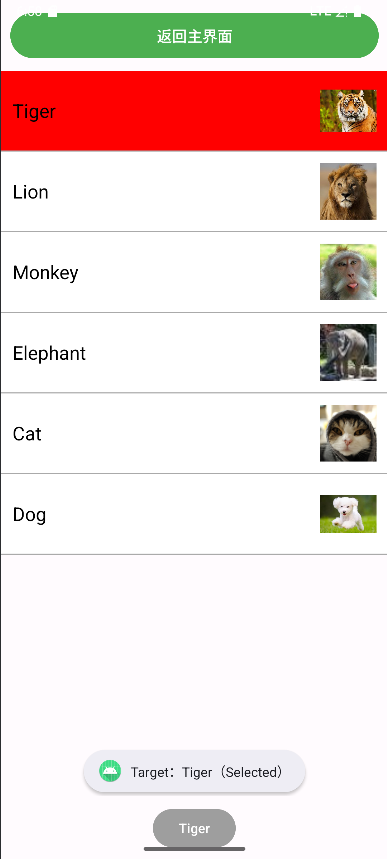

# 实验 3_Android 界面组件实验报告
## 一、实验目的
1. 学习《实验 3_Android 界面组件.pdf》中 ListView、AlertDialog、XML 菜单、ActionMode 上下文菜单的理论与使用方法，掌握组件交互逻辑编写规范。
2. 实现 PDF 指定的四类功能：SimpleAdapter 适配的 ListView 列表（含 Toast 与通知）、自定义布局的 AlertDialog、XML 定义的菜单（字体大小 / 颜色控制）、ActionMode 形式的上下文菜单。
3. 掌握 RecyclerView 与 Card-Based Layout 的自学方法，了解列表组件进阶用法，满足 PDF 中界面交互与视觉要求。

## 二、实验环境
| 工具/环境        | 版本/配置                  |
|------------------|---------------------------|
| Android Studio   | Hedgehog (2023.1.1)        |
| Android SDK      | API 33 (Android 13)        |
| 模拟器/真机      | Pixel 5 API 33 模拟器      |
| 资源文件         | 实验要求的群文件下载资源（动物图标lion_icon/tiger_icon、应用图标app_icon等） |

## 三、实验内容与步骤

### 模块 1：SimpleAdapter 实现 ListView 列表（含 Toast 与通知）
1. **创建列表项布局 res/layout/item_animal.xml**  
   定义单个列表项的结构，包含 ImageView（动物图片）和 TextView（动物名称）：
   ```xml
    <?xml version="1.0" encoding="utf-8"?>
    <LinearLayout xmlns:android="http://schemas.android.com/apk/res/android"
    android:layout_width="match_parent"
    android:layout_height="wrap_content"
    android:orientation="horizontal"
    android:padding="12dp"
    android:gravity="center_vertical"
    android:background="@drawable/item_background"
    android:clickable="false">
    
        <TextView
        android:id="@+id/tv_animal_name"
        android:layout_width="0dp"
            android:layout_height="wrap_content"
            android:layout_weight="1"
            android:textSize="20sp"
            android:textColor="@android:color/black"
            android:layout_marginEnd="15dp"/>
    
        <ImageView
        android:id="@+id/iv_animal"
        android:layout_width="60dp"
        android:layout_height="60dp"
        android:scaleType="fitCenter"/>
    
    </LinearLayout>
   ```

2. **编写主布局 res/layout/activity_animal_list.xml**
   根布局为 LinearLayout，包含 ListView 组件：
   ```xml
    <?xml version="1.0" encoding="utf-8"?>
    <LinearLayout xmlns:android="http://schemas.android.com/apk/res/android"
    android:layout_width="match_parent"
    android:layout_height="match_parent"
    android:orientation="vertical">
    
        <!-- 返回主界面按钮 -->
        <Button
            android:id="@+id/btn_back_to_main"
            android:layout_width="match_parent"
            android:layout_height="wrap_content"
            android:text="返回主界面"
            android:textSize="16sp"
            android:padding="12dp"
            android:layout_margin="10dp"
            android:backgroundTint="#4CAF50"
            android:textColor="@android:color/white"/>
    
        <!-- 动物列表 -->
        <ListView
            android:id="@+id/lv_animal_list"
            android:layout_width="match_parent"
            android:layout_height="0dp"
            android:layout_weight="1"
            android:divider="@android:color/darker_gray"
            android:dividerHeight="1dp"/>
    
        <!-- 底部动态文本按钮（文本随选中动物变化） -->
        <Button
            android:id="@+id/btn_dynamic_animal"
            android:layout_width="wrap_content"
            android:layout_height="wrap_content"
            android:layout_gravity="center"
            android:layout_margin="10dp"
            android:backgroundTint="#9E9E9E"
            android:textColor="@android:color/white"/>
    
    </LinearLayout>
   ```

3. **编写 Java 逻辑代码（AnimalListActivity.java）**
   初始化动物数据、设置 SimpleAdapter、处理 item 点击事件（弹 Toast + 发通知）：
   ```java
   package com.example.componentapplication;
    
    import androidx.annotation.RequiresPermission;
    import androidx.appcompat.app.AppCompatActivity;
    import androidx.core.app.NotificationCompat;
    import androidx.core.app.NotificationManagerCompat;
    
    import android.Manifest;
    import android.app.NotificationChannel;
    import android.app.NotificationManager;
    import android.app.PendingIntent;
    import android.content.Intent;
    import android.os.Build;
    import android.os.Bundle;
    import android.view.View;
    import android.widget.AdapterView;
    import android.widget.Button;
    import android.widget.ListView;
    import android.widget.SimpleAdapter;
    import android.widget.Toast;
    
    import java.util.ArrayList;
    import java.util.HashMap;
    import java.util.List;
    import java.util.Map;
    
    public class AnimalListActivity extends AppCompatActivity {
    
        // 1. 数据准备
        private final String[] animalNames = {"Tiger", "Lion", "Monkey", "Elephant", "Cat", "Dog"};
        private final int[] animalImages = {
                R.drawable.tiger,
                R.drawable.lion,
                R.drawable.monkey,
                R.drawable.elephant,
                R.drawable.cat,
                R.drawable.dog
        };
    
        // 通知相关配置
        private static final String CHANNEL_ID = "animal_channel";
        private ListView lvAnimalList;
        private Button btnBackToMain;
        private Button btnDynamicAnimal;
    
        @Override
        protected void onCreate(Bundle savedInstanceState) {
            super.onCreate(savedInstanceState);
            setContentView(R.layout.activity_animal_list);
    
            lvAnimalList = findViewById(R.id.lv_animal_list);
            btnBackToMain = findViewById(R.id.btn_back_to_main);
            btnDynamicAnimal = findViewById(R.id.btn_dynamic_animal); // 新增：绑定底部按钮
            btnDynamicAnimal.setText("Please select"); // 新增：设置初始文本
    
            // 2. 适配数据到SimpleAdapter
            List<Map<String, Object>> dataList = new ArrayList<>();
            for (int i = 0; i < animalNames.length; i++) {
                Map<String, Object> itemMap = new HashMap<>();
                itemMap.put("image", animalImages[i]);  // 绑定图片资源
                itemMap.put("name", animalNames[i]);    // 绑定名称
                dataList.add(itemMap);
            }
    
            // 3. 创建SimpleAdapter，关联数据与列表项布局
            SimpleAdapter adapter = new SimpleAdapter(
                    this,
                    dataList,
                    R.layout.item_animal,  // 列表项布局
                    new String[]{"image", "name"},  // 数据key
                    new int[]{R.id.iv_animal, R.id.tv_animal_name}  // 布局控件ID
            );
    
            lvAnimalList.setAdapter(adapter);
    
            lvAnimalList.setOnItemClickListener(new AdapterView.OnItemClickListener() {
                @Override
                public void onItemClick(AdapterView<?> parent, View view, int position, long id) {
                    String selectedAnimal = animalNames[position];
    
                    // 切换选中状态（点击一次选中，再点击取消）
                    boolean isSelected = !view.isSelected();
                    view.setSelected(isSelected); // 关键：更新状态
    
                    // 显示Toast
                    Toast.makeText(
                            AnimalListActivity.this,
                            "Target：" + selectedAnimal + (isSelected ? "（Selected）" : "（Unselected）"),
                            Toast.LENGTH_LONG
                    ).show();
    
                    btnDynamicAnimal.setText(selectedAnimal);
                }
            });
    
            // 返回主界面按钮点击事件
            btnBackToMain.setOnClickListener(new View.OnClickListener() {
                @Override
                public void onClick(View v) {
                    // 创建跳转到MainActivity的Intent
                    Intent intent = new Intent(AnimalListActivity.this, MainActivity.class);
                    startActivity(intent);
                    finish(); // 关闭当前Activity，避免返回栈堆积
                }
            });
    
            // 初始化通知渠道（Android 8.0+必需）
            createNotificationChannel();
        }
    
        // 创建通知渠道（适配Android 8.0及以上）
        private void createNotificationChannel() {
            if (Build.VERSION.SDK_INT >= Build.VERSION_CODES.O) {
                NotificationChannel channel = new NotificationChannel(
                        CHANNEL_ID,
                        "动物列表通知",  // 渠道名称
                        NotificationManager.IMPORTANCE_DEFAULT
                );
                channel.setDescription("显示动物列表的选中通知");  // 渠道描述
                NotificationManager manager = getSystemService(NotificationManager.class);
                manager.createNotificationChannel(channel);
            }
        }
    
        // （4）发送通知：图标为应用图标，标题为列表项内容
        @RequiresPermission(Manifest.permission.POST_NOTIFICATIONS)
        private void sendNotification(String animalName) {
            // 点击通知跳转的意图（此处跳回当前页面）
            Intent intent = new Intent(this, AnimalListActivity.class);
            PendingIntent pendingIntent = PendingIntent.getActivity(
                    this, 0, intent, PendingIntent.FLAG_IMMUTABLE
            );
    
            // 构建通知
            NotificationCompat.Builder builder = new NotificationCompat.Builder(this, CHANNEL_ID)
                    .setSmallIcon(R.mipmap.ic_launcher)  // （4）通知图标：应用程序图标
                    .setContentTitle(animalName)         // （4）通知标题：列表项内容
                    .setContentText("你查看了[" + animalName + "]的信息")  // （4）通知内容自拟
                    .setContentIntent(pendingIntent)
                    .setAutoCancel(true)  // 点击后自动取消
                    .setPriority(NotificationCompat.PRIORITY_DEFAULT);
    
            // 发送通知
            NotificationManagerCompat.from(this).notify(1, builder.build());
        }
    }
   ```

### 模块 2：创建自定义布局的 AlertDialog
1. **创建对话框布局 res/layout/dialog_custom.xml**
   包含 Username/Password 输入框与 Cancel/Sign in 按钮：
   ```xml
   <?xml version="1.0" encoding="utf-8"?>
    <LinearLayout
        xmlns:android="http://schemas.android.com/apk/res/android"
        android:layout_width="match_parent"
        android:layout_height="wrap_content"
        android:orientation="vertical"
        android:padding="20dp">

        <!-- 用户名（文档“Username”要求） -->
        <LinearLayout
            android:layout_width="match_parent"
            android:layout_height="wrap_content"
            android:gravity="center_vertical"
            android:layout_marginBottom="15dp">

            <TextView
                android:layout_width="wrap_content"
                android:layout_height="wrap_content"
                android:text="Username:"
                android:textSize="16sp"/>

            <EditText
                android:id="@+id/et_username"
                android:layout_width="match_parent"
                android:layout_height="wrap_content"
                android:hint="Enter username"
                android:layout_marginStart="10dp"/>
        </LinearLayout>

        <!-- 密码（文档“Password”要求） -->
        <LinearLayout
            android:layout_width="match_parent"
            android:layout_height="wrap_content"
            android:gravity="center_vertical"
            android:layout_marginBottom="20dp">

            <TextView
                android:layout_width="wrap_content"
                android:layout_height="wrap_content"
                android:text="Password:"
                android:textSize="16sp"/>

            <EditText
                android:id="@+id/et_password"
                android:layout_width="match_parent"
                android:layout_height="wrap_content"
                android:hint="Enter password"
                android:inputType="textPassword"
            android:layout_marginStart="10dp"/>
        </LinearLayout>

        <!-- 按钮（Cancel + Sign in，文档要求） -->
        <LinearLayout
            android:layout_width="match_parent"
            android:layout_height="wrap_content"
            android:gravity="end">

            <Button
                android:id="@+id/btn_cancel"
                android:layout_width="wrap_content"
                android:layout_height="wrap_content"
                android:text="Cancel"
                android:layout_marginEnd="10dp"/>

            <Button
                android:id="@+id/btn_signin"
                android:layout_width="wrap_content"
                android:layout_height="wrap_content"
                android:text="Sign in"/>
        </LinearLayout>

    </LinearLayout>
   ```

2. **创建对话框布局 res/layout/activity_alert_dialog.xml**
   包含一个按钮用于跳转至dialog_custom.xml：
   ```xml
   <?xml version="1.0" encoding="utf-8"?>
    <LinearLayout
        xmlns:android="http://schemas.android.com/apk/res/android"
        android:layout_width="match_parent"
        android:layout_height="match_parent"
        android:gravity="center">

        <Button
            android:id="@+id/btn_show_dialog"
            android:layout_width="wrap_content"
            android:layout_height="wrap_content"
            android:text="显示自定义AlertDialog"/>

        <!-- 返回主界面按钮 -->
        <Button
            android:id="@+id/btn_back_to_main"
            android:layout_width="match_parent"
            android:layout_height="wrap_content"
            android:text="返回主界面"
            android:textSize="16sp"
            android:padding="12dp"
            android:layout_margin="10dp"
            android:backgroundTint="#4CAF50"
            android:textColor="@android:color/white"/>

    </LinearLayout>
   ```

3. **编写对话框调用逻辑（AlertDialogActivity.java）**
   加载自定义布局，设置按钮点击事件：
   ```java
   package com.example.componentapplication;

    import android.app.AlertDialog;
    import android.content.Intent;
    import android.os.Bundle;
    import android.view.KeyEvent;
    import android.view.LayoutInflater;
    import android.view.View;
    import android.widget.Button;
    import android.widget.EditText;
    import android.widget.Toast;
    import androidx.appcompat.app.AppCompatActivity;

    public class AlertDialogActivity extends AppCompatActivity {
        private Button btnBackToMain;

        @Override
        protected void onCreate(Bundle savedInstanceState) {
            super.onCreate(savedInstanceState);
            setContentView(R.layout.activity_alert_dialog);

            btnBackToMain = findViewById(R.id.btn_back_to_main);

            // 点击按钮弹出自定义对话框
            Button btnShowDialog = findViewById(R.id.btn_show_dialog);
            btnShowDialog.setOnClickListener(new View.OnClickListener() {
                @Override
                public void onClick(View v) {
                    showCustomAlertDialog();
                }
            });

            // 返回主界面按钮点击事件
            btnBackToMain.setOnClickListener(new View.OnClickListener() {
                @Override
                public void onClick(View v) {
                    // 创建跳转到MainActivity的Intent
                    Intent intent = new Intent(AlertDialogActivity.this, MainActivity.class);
                    startActivity(intent);
                    finish(); // 关闭当前Activity，避免返回栈堆积
                }
            });
        }

        // 显示自定义AlertDialog（文档“调用setView()添加布局”要求）
        private void showCustomAlertDialog() {
            // 1. 加载自定义布局
            View dialogView = LayoutInflater.from(this).inflate(R.layout.dialog_custom, null);

            // 2. 创建AlertDialog.Builder并设置布局
            AlertDialog.Builder builder = new AlertDialog.Builder(this);
            builder.setView(dialogView)  // 核心：添加自定义布局
                    .setTitle("User Login");  // 对话框标题（可选）

            // 3. 获取布局中的控件（用户名、密码、按钮）
            EditText etUsername = dialogView.findViewById(R.id.et_username);
            EditText etPassword = dialogView.findViewById(R.id.et_password);
            Button btnCancel = dialogView.findViewById(R.id.btn_cancel);
            Button btnSignIn = dialogView.findViewById(R.id.btn_signin);

            // 4. 创建并显示对话框
            AlertDialog dialog = builder.create();
            dialog.show();

            // 5. 绑定Cancel按钮事件（关闭对话框）
            btnCancel.setOnClickListener(new View.OnClickListener() {
                @Override
                public void onClick(View v) {
                    dialog.dismiss();
                }
            });

            // 6. 绑定Sign in按钮事件（验证输入并提示）
            btnSignIn.setOnClickListener(new View.OnClickListener() {
                @Override
                public void onClick(View v) {
                    String username = etUsername.getText().toString().trim();
                    String password = etPassword.getText().toString().trim();

                    // 简单输入验证
                    if (username.isEmpty() || password.isEmpty()) {
                        Toast.makeText(AlertDialogActivity.this, "用户名或密码不能为空", Toast.LENGTH_SHORT).show();
                    } else {
                        Toast.makeText(AlertDialogActivity.this, "登录成功！用户名：" + username, Toast.LENGTH_SHORT).show();
                        dialog.dismiss();  // 关闭对话框
                    }
                }
            });
        }

        @Override
        public boolean onKeyDown(int keyCode, KeyEvent event) {
            if (keyCode == KeyEvent.KEYCODE_ENTER) {
                finish();
                return true;
            }
            return super.onKeyDown(keyCode, event);
        }
    }

   ```

### 模块 3：使用 XML 定义菜单
1.  **创建菜单文件 res/menu/menu_main.xml**
    包含 “字体大小”（子菜单）、“普通菜单项”、“字体颜色”（子菜单）：
    ```xml
    <?xml version="1.0" encoding="utf-8"?>
    <menu xmlns:android="http://schemas.android.com/apk/res/android"
        xmlns:app="http://schemas.android.com/apk/res-auto">

        <!-- 1. 字体大小（子菜单：小10号、中16号、大20号，文档要求） -->
        <item
            android:id="@+id/menu_text_size"
            android:title="字体大小"
            app:showAsAction="never">  <!-- 永远在溢出菜单中显示 -->
            <menu>
                <item
                    android:id="@+id/size_small"
                    android:title="小（10号）"/>
                <item
                    android:id="@+id/size_medium"
                    android:title="中（16号）"/>
                <item
                    android:id="@+id/size_large"
                    android:title="大（20号）"/>
            </menu>
        </item>

        <!-- 2. 普通菜单项（点击弹出Toast，文档要求） -->
        <item
            android:id="@+id/menu_normal"
            android:title="普通菜单项"
            app:showAsAction="never"/>

        <!-- 3. 字体颜色（子菜单：红色、黑色，文档要求） -->
        <item
            android:id="@+id/menu_text_color"
            android:title="字体颜色"
            app:showAsAction="never">
            <menu>
                <item
                    android:id="@+id/color_red"
                    android:title="红色"/>
                <item
                    android:id="@+id/color_black"
                    android:title="黑色"/>
            </menu>
        </item>

    </menu>
    ```

2.  **创建菜单文件 res/menu/activity_menu.xml**
    包含 “测试文本”：
    ```xml
    <?xml version="1.0" encoding="utf-8"?>
    <LinearLayout
        xmlns:android="http://schemas.android.com/apk/res/android"
        android:layout_width="match_parent"
        android:layout_height="match_parent"
        android:gravity="center"
        android:padding="20dp">

        <!-- 测试文本（文档“用于测试的内容”要求） -->
        <TextView
            android:id="@+id/tv_test"
            android:layout_width="wrap_content"
            android:layout_height="wrap_content"
            android:text="用于测试的内容"
            android:textSize="16sp"
        android:textColor="@android:color/black"/>

        <!-- 返回主界面按钮 -->
        <Button
            android:id="@+id/btn_back_to_main"
            android:layout_width="match_parent"
            android:layout_height="wrap_content"
            android:text="返回主界面"
            android:textSize="16sp"
            android:padding="12dp"
            android:layout_margin="10dp"
            android:backgroundTint="#4CAF50"
            android:textColor="@android:color/white"/>

    </LinearLayout>
    ```
3.  **编写主布局与菜单逻辑（MenuActivity.java）**
    主布局含测试文本 TextView，逻辑中加载菜单并处理点击：
    ```java
    package com.example.componentapplication;

    import android.content.Intent;
    import android.graphics.Color;
    import android.os.Bundle;
    import android.view.KeyEvent;
    import android.view.Menu;
    import android.view.MenuItem;
    import android.view.View;
    import android.widget.Button;
    import android.widget.TextView;
    import android.widget.Toast;
    import androidx.appcompat.app.AppCompatActivity;

    public class MenuActivity extends AppCompatActivity {

        private TextView tvTest;  // 测试文本控件（用于修改字体样式）
        private Button btnBackToMain;

        @Override
        protected void onCreate(Bundle savedInstanceState) {
            super.onCreate(savedInstanceState);
            setContentView(R.layout.activity_menu);

            btnBackToMain = findViewById(R.id.btn_back_to_main);
            tvTest = findViewById(R.id.tv_test);

            // 返回主界面按钮点击事件
            btnBackToMain.setOnClickListener(new View.OnClickListener() {
                @Override
                public void onClick(View v) {
                    // 创建跳转到MainActivity的Intent
                    Intent intent = new Intent(MenuActivity.this, MainActivity.class);
                    startActivity(intent);
                    finish(); // 关闭当前Activity，避免返回栈堆积
                }
            });
        }

        // 加载菜单（将XML菜单 Inflate 到界面）
        @Override
        public boolean onCreateOptionsMenu(Menu menu) {
            getMenuInflater().inflate(R.menu.menu_main, menu);
            return true;
        }

        // 处理菜单项点击事件
        @Override
        public boolean onOptionsItemSelected(MenuItem item) {
            int id = item.getItemId();
            if (id == R.id.size_small) {
                tvTest.setTextSize(10); // 设置10号字
                return true;
            } else if (id == R.id.size_medium) {
                tvTest.setTextSize(16); // 设置16号字
                return true;
            } else if (id == R.id.size_large) {
                tvTest.setTextSize(20); // 设置20号字
                return true;
            } else if (id == R.id.menu_normal) {
                Toast.makeText(this, "点击了普通菜单项", Toast.LENGTH_SHORT).show(); // Toast提示
                return true;
            } else if (id == R.id.color_red) {
                tvTest.setTextColor(Color.RED); // 设置红色
                return true;
            } else if (id == R.id.color_black) {
                tvTest.setTextColor(Color.BLACK); // 设置黑色
                return true;
            }
            return super.onOptionsItemSelected(item);
        }
    }
    ```


### 模块 4：创建 ActionMode 的上下文菜单
1.  **创建菜单文件 res/menu/activity_action_mode.xml**
    包含 ItemList、顶部操作栏：
    ```xml
    <?xml version="1.0" encoding="utf-8"?>
    <LinearLayout xmlns:android="http://schemas.android.com/apk/res/android"
        xmlns:app="http://schemas.android.com/apk/res-auto"
        android:layout_width="match_parent"
        android:layout_height="match_parent"
        android:orientation="vertical"
        android:clickable="false"
        android:descendantFocusability="beforeDescendants">

        <!-- 1. 顶部操作栏（高度wrap_content，不遮挡下方） -->
        <LinearLayout
            android:layout_width="match_parent"
            android:layout_height="wrap_content"
        android:background="@android:color/holo_blue_dark"
        android:gravity="center_vertical"
        android:orientation="horizontal"
        android:padding="8dp"
        android:clickable="false">

        <CheckBox
            android:id="@+id/cb_select_all"
            android:layout_width="wrap_content"
            android:layout_height="wrap_content"
            app:buttonTint="@android:color/white" />

        <TextView
            android:id="@+id/tv_selected_count"
            android:layout_width="wrap_content"
            android:layout_height="wrap_content"
            android:text="0 selected"
            android:textColor="@android:color/white"
            android:textSize="18sp"
            android:layout_marginStart="8dp" />

        <ImageView
            android:id="@+id/iv_delete"
            android:layout_width="wrap_content"
            android:layout_height="wrap_content"
            android:src="@android:drawable/ic_menu_delete"
            app:tint="@android:color/white"
            android:layout_gravity="end"
            android:layout_marginStart="16dp"
            android:clickable="true"
        android:focusable="true" />
        </LinearLayout>

        <Button
        android:id="@+id/btn_back_to_main"
        android:layout_width="match_parent"
        android:layout_height="wrap_content"
        android:text="返回主界面"
        android:textSize="16sp"
        android:padding="12dp"
        android:layout_margin="10dp"
        android:backgroundTint="#4CAF50"
        android:textColor="@android:color/white"
        android:clickable="true"
        android:focusable="true" />


        <ListView
        android:id="@+id/lv_actionmode"
        android:layout_width="match_parent"
        android:layout_height="0dp"
            android:layout_weight="1"
            android:choiceMode="multipleChoice"
            android:listSelector="@android:color/transparent"
            android:clickable="false" />

    </LinearLayout>
    ```

2.  **创建菜单文件 res/menu/item_actionmode.xml**
    包含 ItemList、顶部操作栏：
    ```xml
    <?xml version="1.0" encoding="utf-8"?>
    <LinearLayout xmlns:android="http://schemas.android.com/apk/res/android"
        android:layout_width="match_parent"
        android:layout_height="wrap_content"
        android:background="@drawable/item_background"
        android:clickable="false"
        android:duplicateParentState="true"
        android:gravity="center_vertical"
        android:orientation="horizontal"
        android:padding="16dp">

        <ImageView
        android:id="@+id/iv_icon"
        android:layout_width="48dp"
        android:layout_height="48dp"
        android:src="@mipmap/ic_launcher" />

        <TextView
        android:id="@+id/tv_text"
        android:layout_width="wrap_content"
        android:layout_height="wrap_content"
        android:layout_marginStart="16dp"
        android:textSize="18sp" />
    </LinearLayout>
    ```

3.  **编写辅助方法（CustomAdaptor.java）**
    ```java
    package com.example.componentapplication;

    import android.content.Context;
    import android.graphics.Color;
    import android.view.LayoutInflater;
    import android.view.View;
    import android.view.ViewGroup;
    import android.widget.ArrayAdapter;
    import android.widget.ListView;
    import android.widget.TextView;

    import java.util.List;

    public class CustomAdapter extends ArrayAdapter<String> {

        private List<Integer> selectedPositions;
        // 引入颜色资源（避免硬编码）
        private int colorSelected;
        private int colorDefault;

        public CustomAdapter(Context context, int resource, int textViewResourceId,
                            List<String> objects, List<Integer> selectedPositions) {
            super(context, resource, textViewResourceId, objects);
            this.selectedPositions = selectedPositions;
            // 初始化颜色（从资源中获取，确保和选择器一致）
            colorSelected = context.getResources().getColor(R.color.blue_selected, context.getTheme());
            colorDefault = context.getResources().getColor(R.color.white, context.getTheme());
        }

        @Override
        public View getView(int position, View convertView, ViewGroup parent) {
            if (convertView == null) {
                convertView = LayoutInflater.from(getContext())
                        .inflate(R.layout.item_actionmode, parent, false);
            }

            TextView tvText = convertView.findViewById(R.id.tv_text);
            tvText.setText(getItem(position));

            // 1. 打印日志：确认系统选中状态是否正确
            boolean isActivated = ((ListView) parent).isItemChecked(position);
            // 查看 Logcat（筛选“AdapterState”），确认选中时isActivated为true
            android.util.Log.d("AdapterState", "位置" + position + "：isActivated=" + isActivated);

            // 2. 先通过系统状态设置 activated（触发选择器）
            convertView.setActivated(isActivated);

            // 3. 兜底：若选择器仍不生效，直接设置背景色（用于排查问题）
            if (isActivated) {
                convertView.setBackgroundColor(colorSelected); // 直接设蓝色
            } else {
                convertView.setBackgroundColor(colorDefault); // 直接设白色
            }

            return convertView;
        }
    }
    ```

4.  **编写主布局与逻辑（ActionModeActivity.java）**
    用 ListView 实现，长按 item 启动 ActionMode，处理选中与取消：
    ```java
    package com.example.componentapplication;

    import android.content.Intent;
    import android.os.Bundle;
    import android.view.View;
    import android.widget.Button;
    import android.widget.CheckBox;
    import android.widget.CompoundButton;
    import android.widget.ImageView;
    import android.widget.ListView;
    import android.widget.TextView;
    import android.widget.Toast;

    import androidx.appcompat.app.AppCompatActivity;

    import java.util.ArrayList;
    import java.util.List;

    public class ActionModeActivity extends AppCompatActivity {

        private ListView lvActionMode;
        private Button btnBackToMain;
        private CustomAdapter adapter;
        private List<String> dataList;
        private List<Integer> selectedPositions = new ArrayList<>();

        private CheckBox cbSelectAll;
        private TextView tvSelectedCount;
        private ImageView ivDelete;

        // 全选复选框监听器
        private CompoundButton.OnCheckedChangeListener checkedChangeListener = (buttonView, isChecked) -> {
            boolean isAlreadyFullSelected = selectedPositions.size() == dataList.size();
            if (isChecked && isAlreadyFullSelected) {
                return; // 过滤被动触发
            }

            if (isChecked) {
                // 全选：同步自定义列表 + 系统状态
                selectedPositions.clear();
                for (int i = 0; i < dataList.size(); i++) {
                    selectedPositions.add(i);
                    lvActionMode.setItemChecked(i, true);
                }
            } else {
                // 取消全选：同步自定义列表 + 系统状态
                selectedPositions.clear();
                for (int i = 0; i < dataList.size(); i++) {
                    lvActionMode.setItemChecked(i, false);
                }
            }
            adapter.notifyDataSetChanged();
            lvActionMode.invalidateViews(); // 强制刷新
            updateSelectedCount();
        };

        @Override
        protected void onCreate(Bundle savedInstanceState) {
            super.onCreate(savedInstanceState);
            setContentView(R.layout.activity_action_mode);

            // 绑定控件
            btnBackToMain = findViewById(R.id.btn_back_to_main);
            lvActionMode = findViewById(R.id.lv_actionmode);
            lvActionMode.setChoiceMode(ListView.CHOICE_MODE_MULTIPLE); // 开启系统多选
            cbSelectAll = findViewById(R.id.cb_select_all);
            tvSelectedCount = findViewById(R.id.tv_selected_count);
            ivDelete = findViewById(R.id.iv_delete);

            // 列表数据
            dataList = new ArrayList<>();
            dataList.add("One");
            dataList.add("Two");
            dataList.add("Three");
            dataList.add("Four");
            dataList.add("Five");

            // 初始化适配器
            adapter = new CustomAdapter(
                    this,
                    R.layout.item_actionmode,
                    R.id.tv_text,
                    dataList,
                    selectedPositions
            );
            lvActionMode.setAdapter(adapter);

            // 绑定全选监听器
            cbSelectAll.setOnCheckedChangeListener(checkedChangeListener);

            // 返回主界面
            btnBackToMain.setOnClickListener(v -> {
                startActivity(new Intent(ActionModeActivity.this, MainActivity.class));
                finish();
            });

            // 删除按钮逻辑
            ivDelete.setOnClickListener(v -> {
                Toast.makeText(this, "删除了 " + selectedPositions.size() + " 项", Toast.LENGTH_SHORT).show();
                // 倒序删除数据
                for (int i = selectedPositions.size() - 1; i >= 0; i--) {
                    dataList.remove(selectedPositions.get(i).intValue());
                }
                // 取消所有系统选中状态
                for (int i = 0; i < dataList.size(); i++) {
                    lvActionMode.setItemChecked(i, false);
                }
                selectedPositions.clear();
                adapter.notifyDataSetChanged();
                lvActionMode.invalidateViews(); // 强制刷新
                updateSelectedCount();
            });

            // 列表项点击事件（短按/长按）
            lvActionMode.setOnItemClickListener((parent, view, position, id) -> {
                toggleSelection(position, view);
            });
            lvActionMode.setOnItemLongClickListener((parent, view, position, id) -> {
                toggleSelection(position, view);
                return true;
            });
        }

        private void toggleSelection(int position, View clickView) {
            // 确认列表项点击事件触发
            Toast.makeText(this, "列表项 " + position + " 被点击", Toast.LENGTH_SHORT).show();

            // 原有逻辑（遍历判断选中、同步系统状态...）
            boolean isChecked = false;
            for (int i = 0; i < selectedPositions.size(); i++) {
                if (selectedPositions.get(i) == position) {
                    isChecked = true;
                    break;
                }
            }

            lvActionMode.setItemChecked(position, !isChecked);

            if (isChecked) {
                for (int i = 0; i < selectedPositions.size(); i++) {
                    if (selectedPositions.get(i) == position) {
                        selectedPositions.remove(i);
                        break;
                    }
                }
                clickView.setActivated(false);
            } else {
                selectedPositions.add(position);
                clickView.setActivated(true);
            }

            adapter.notifyDataSetChanged();
            lvActionMode.invalidateViews();
            updateSelectedCount();
        }

        // 更新选中数和全选状态
        private void updateSelectedCount() {
            tvSelectedCount.setText(selectedPositions.size() + " selected");
            // 临时移除监听器，避免循环触发
            cbSelectAll.setOnCheckedChangeListener(null);
            cbSelectAll.setChecked(selectedPositions.size() == dataList.size());
            cbSelectAll.setOnCheckedChangeListener(checkedChangeListener);
        }
    }
    ```

## 四、实验截图展示
1.  **主页面展示：用于布置选项按钮，进入相关任务的界面，如下所示：**<br>
    

2.  **任务1展示：用于展示任务1界面布局，如下所示：**<br>
    

3.  **任务2展示：用于展示任务2界面布局，如下所示：**<br>
    

4.  **任务3展示：用于展示任务3界面布局，如下所示：**<br>
    

5.  **任务4展示：用于展示任务4界面布局，如下所示：**<br>
    

## 五、实验总结
1.  **组件适配场景：**
    - ListView：适合简单列表（如动物列表），用 SimpleAdapter 快速适配 “图片 + 文本” 数据。
    - AlertDialog：适合自定义交互弹窗（如登录），通过 setView () 加载 XML 布局。
    - XML 菜单：适合统一应用导航（如字体控制），子菜单可分类管理选项。
    - ActionMode：适合列表项长按操作（如删除），提供顶部上下文导航栏。

2.  **关键问题解决：**
    - 通知适配：Android 8.0 + 需创建NotificationChannel，否则通知无法显示。
    - 菜单子项处理：通过onOptionsItemSelected的 itemId 判断，区分 “字体大小”“颜色” 等子项。
    - ActionMode 启动：需在 ListView 长按事件中调用startSupportActionMode，并通过 Callback 处理生命周期。
    
3.  **实验局限：**
    - 未实现 RecyclerView 的实际功能，仅完成理论学习；后续可结合 CardView 实现复杂列表。
    - 菜单与 ActionMode 未适配横屏，需补充横屏布局（layout-land目录）。
